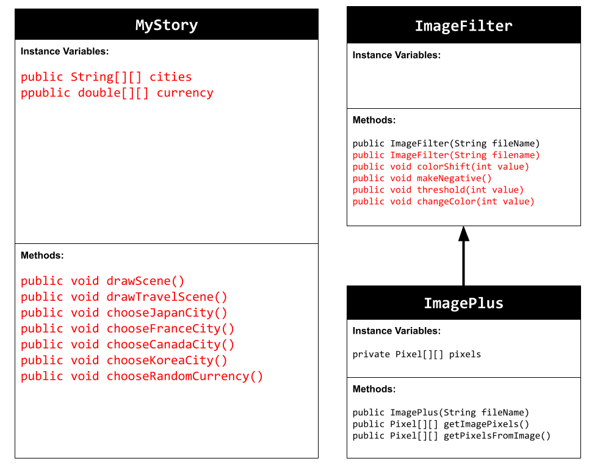
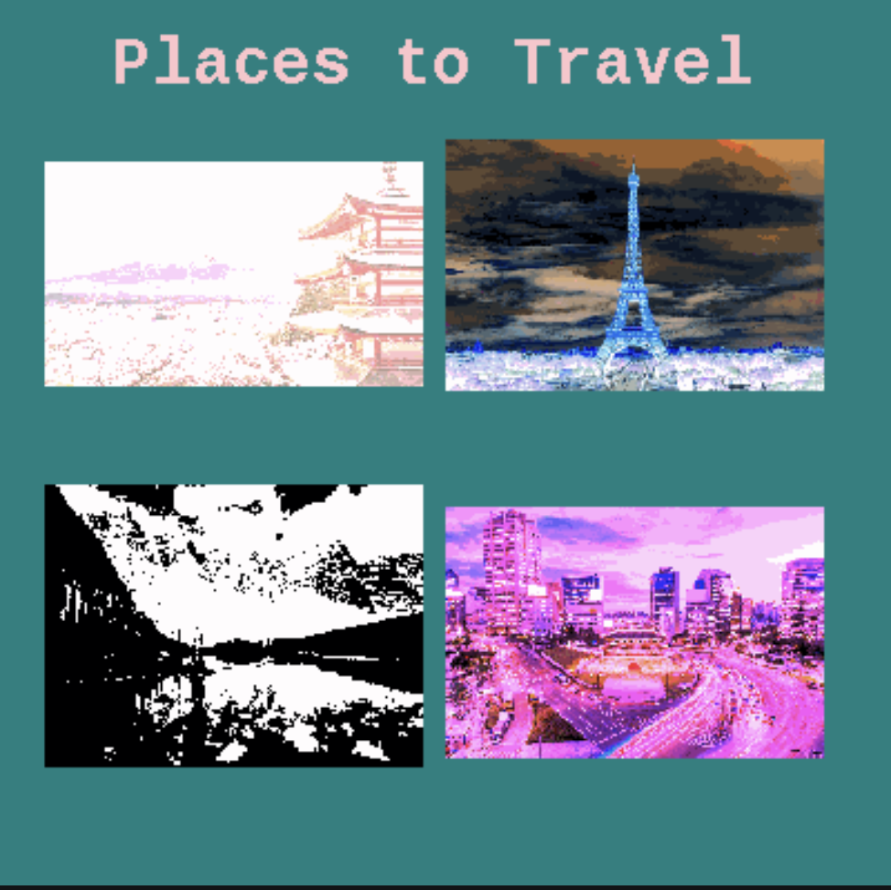

# personal-narrative-project
# Unit 4 - Personal Narrative

## Introduction

Images are often used to portray our personal experiences and interests. We also use image filters and effects to change or enhance the mood of an image. When combined into collages and presentations, these images tell a story about who we are and what is important to us. Your goal is to create a personal narrative using The Theater that consists of images of your personal experiences and/or interests, incorporates data related to these experiences and/or interests that can be organized in a 2D array, and uses image filters and effects to change or enhance the mood of your images.

## Requirements

Use your knowledge of object-oriented programming, two-dimensional (2D) arrays, and algorithms to create your personal narrative collage or animation:

- **Create at least two 2D arrays** – Create at least two 2D arrays to store the data that will make up your visualization.
- **Implement one or more algorithms** – Implement one or more algorithms that use loops and two-way or multi-selection statements with compound Boolean expressions to analyze the data.
- **Use Image Filters** - Include multiple image filters learned from this unit, and additionally create new ones of your own.
- **Use methods in the String class** – Use one or more methods in the String class in your program, such as to determine whether the name of an image file contains specific characters.
- **Create a visualization** – Create an image or animation that conveys the story of the data by illustrating the patterns or relationships in the data.
- **Document your code** – Use comments to explain the purpose of the methods and code segments and note any preconditions and postconditions.

## UML Diagram

## Video

## Story Description

My story animation showcases four countries-Japan, France, Canada, and Korea. The first scene introduces all four of the countries and puts a filter on the photos. In the next four scenes, the animation randomly chooses a city in the corresponding country and prints it out. On the last scene, the animation chooses a random currency conversion of $0.25, $0.50, $1, $10, and $100. 

## Image Filter Analysis

The changeColor() image filter changes the photo to purple by multiplying the red and blue values by 3 if the number inputted is greater than 150. If the number inputted by the user is less than 150, the image turns green. 

The colorShift() image filter shifts the red, blue, and green colors based on the number the user inputs. The program first gets the color values of the orignial photo, then adds the new values. The new added values are then set. However, if the color value exceeds 255, the color is set to 255.  